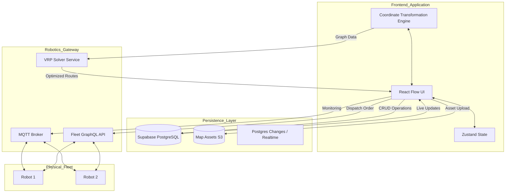

# Lertvilai Fleet Management System

A professional-grade Warehouse Management System (WMS) and Robot Fleet Orchestration platform. This system provides a digital twin interface for warehouse operations, enabling high-precision map design, automated task optimization, and real-time multi-robot monitoring.

## System Overview

The platform is designed to bridge the gap between high-level warehouse logic and low-level robotic execution. It adheres to industrial robotics standards, specifically the Robot Operating System (ROS) spatial configurations, ensuring seamless integration between the web-based control center and physical robot hardware.

## Core Modules

### 1. Precision Map Designer
The Map Designer allows engineers to create and manage the warehouse topology using an interactive graph-based interface.
- **Node Entities**: Support for Waypoints, Shelves (Multi-level), Conveyors, and Depot stations.
- **Topological Mapping**: Create directed or undirected edges between nodes to define valid robot paths.
- **Dynamic Level Management**: Hierarchical storage management allowing for cell-level precision within shelf units.
- **Asset Support**: Native support for PGM and PNG floorplan uploads with resolution-based scaling.

### 2. Intelligent Task Optimization
A central hub for managing warehouse throughput and vehicle routing.
- **VRP Solver Integration**: Utilizes Vehicle Routing Problem algorithms to distribute tasks across the fleet efficiently.
- **A* Pathfinding Preview**: Real-time preview of calculated paths using the A-star algorithm before dispatching to hardware.
- **Task Queue Orchestration**: Comprehensive management of pickup and delivery sequences with priority handling.

### 3. Fleet Monitoring and Control
Real-time observation of the robotic fleet's health and spatial status.
- **Live Telemetry**: Monitor robot pose (X, Y, Yaw), battery levels, and operational states.
- **Path Visualization**: Real-time rendering of active paths and historical breadcrumbs.
- **Gateway Integration**: Low-latency communication via GraphQL and MQTT gateways.

## Technical Architecture

The following diagram illustrates the data flow and integration points between the frontend application, the persistence layer, and the robotic hardware.



## Coordinate System Standard

To ensure 100% compatibility with the Robot Operating System (ROS), the system utilizes a resolution-based transformation matrix. This eliminates fixed scale factors and accounts for the Y-axis inversion between Web Canvas and ROS standards.

### Mathematical Transformations

| Direction | Component | Formula |
| :--- | :--- | :--- |
| **ROS to Web (Pixel)** | X | `(Meter_X - Origin_X) / Resolution` |
| | Y | `ImgHeight - ((Meter_Y - Origin_Y) / Resolution)` |
| **Web to ROS (Meter)** | X | `(Pixel_X * Resolution) + Origin_X` |
| | Y | `((ImgHeight - Pixel_Y) * Resolution) + Origin_Y` |

*Note: All Y-axis calculations incorporate the inversion logic where ROS +Y is Up and Web +Y is Down.*

## Technology Stack

- **Framework**: React 18 with TypeScript
- **State Management**: Zustand (Global UI State) and React Flow Store (Graph State)
- **Visualization**: React Flow (High-performance canvas rendering)
- **Backend Service**: Supabase (PostgreSQL, Realtime, Authentication)
- **Robotics Integration**: Apollo/GraphQL for order dispatch and MQTT for telemetry
- **Styling**: Tailwind CSS with Dark Mode support
- **Build Tool**: Vite

## Setup and Installation

### Prerequisites
- Node.js (Version 18 or higher)
- Supabase Project URL and Public Key

### Installation Steps
1. Clone the repository.
2. Install dependencies:
   ```bash
   npm install
   ```
3. Configure environment variables in `.env`:
   ```env
   VITE_SUPABASE_URL=your_project_url
   VITE_SUPABASE_ANON_KEY=your_public_key
   ```
4. Start the development server:
   ```bash
   npm run dev
   ```

## Development Lifecycle
- **Research**: Adhering to ROS standards for spatial data consistency.
- **Strategy**: Using Graph Theory for warehouse topology and VRP for fleet optimization.
- **Execution**: Modular component architecture for high maintainability.
