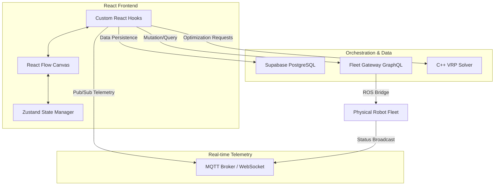

# Lertvilai Fleet Management System (WCS Frontend)

## 1. Project Overview
The Lertvilai Fleet Management System is a production-grade Warehouse Control System (WCS) frontend designed for the real-time orchestration and visualization of autonomous robot fleets. This application serves as the central command center for warehouse operators, enabling complex graph-based layout management, multi-robot pathfinding via a C++ Vehicle Routing Problem (VRP) solver, and high-frequency telemetry monitoring through a hybrid MQTT and GraphQL infrastructure.

The system translates high-level warehouse logic into actionable robot commands, ensuring safe navigation, task decomposition, and efficient fleet utilization within a spatially-aware environment.

---

## 2. System Architecture
The following diagram illustrates the data flow and integration points between the frontend application, telemetry layers, and backend orchestration services.



---

## 3. Tech Stack
*   Framework: React 19 (TypeScript)
*   Build Tool: Vite
*   Visualization: React Flow (Canvas-based node/edge management)
*   State Management: Zustand (Immutable store with undo/redo)
*   Styling: TailwindCSS
*   Telemetry: MQTT (Paho/MQTT.js) and GraphQL Polling
*   Database: Supabase (PostgreSQL with PostGIS/pgRouting)
*   Deployment: Docker (Multi-stage builds) and Nginx

---

## 4. Project Structure
```text
/
├── .claude/                # Agent-specific settings and worktrees
├── public/                 # Static assets (icons, manifest)
└── src/
    ├── assets/             # Global image and SVG resources
    ├── components/         # UI components and specialized panels
    │   ├── graph-editor/   # Tools for warehouse map manipulation
    │   ├── nodes/          # Custom React Flow node implementations
    │   └── ui/             # Reusable atomic UI elements
    ├── hooks/              # Business logic (MQTT, GraphQL, Graph CRUD)
    ├── lib/                # Third-party client initializations (Supabase)
    ├── store/              # Zustand global state definitions
    ├── types/              # TypeScript interfaces and database schemas
    └── utils/              # Coordinate math, API wrappers, and converters
```

---

## 5. Server Requirements

> **Important:** The WCS server must run on **Ubuntu Linux**. Running via Docker Desktop on macOS is not supported because Docker on Mac runs containers inside an isolated virtual machine that cannot reach the local network (10.x.x.x) where the robot lives. This causes `fleet_gateway` to report the robot as OFFLINE even though the network is physically reachable from the Mac host.

**Recommended server OS:** Ubuntu 22.04 LTS or later

---

## 6. Prerequisites & Installation

### Requirements
*   Node.js 20.x or higher
*   npm 10.x or higher
*   Docker and Docker Compose (for containerized deployment)

### Local Development
1. Clone the repository and navigate to the project root.
2. Install dependencies:
   ```bash
   npm install
   ```
3. Configure environment variables in a `.env` file (see Environment Variables section).
4. Start the development server:
   ```bash
   npm run dev
   ```

### Docker Deployment
Build and run the production-ready container:
```bash
docker compose up --build
```
The application will be served via Nginx on port 80, with built-in security headers and reverse proxying for backend services.

---

## 7. Full System Startup Guide

Follow these steps in order every time you start the system.

### Step 1 — Find the Server IP Address

On the Ubuntu server machine, run:

```bash
hostname -I
```

The first IP address shown is the server IP (e.g., `10.61.6.89`). Note this down — you will need it for the robot configuration in the next step.

---

### Step 2 — Configure the Robot to Point at the Server

SSH into the robot from your machine:

```bash
ssh admin@<ROBOT_IP>
```

Then open the robot's server configuration file:

```bash
nano /home/admin/facobot_ws/scripts/server_config.yaml
```

Update the file with the server IP and the `ANON_KEY` from the `.env` file on the server (the file is generated by `env_init.sh` in the WCS repo):

```yaml
# Configuration for WCS Server connection
server_ip: "<SERVER_IP>"       # Replace with the IP found in Step 1
anon_key: "<ANON_KEY>"         # Copy the ANON_KEY value from the server .env file
```

Save and exit (`Ctrl+O`, `Enter`, `Ctrl+X`).

---

### Step 3 — Start the WCS Server (on the Ubuntu server)

```bash
cd ~/path/to/wcs
docker compose up -d
```

---

### Step 4 — Start All Robot Services (on the robot via SSH)

Run the main bringup script, which starts ROS 2 navigation, Modbus driver, and the web interface bridge:

```bash
cd ~ && facobot_ws/scripts/run_all.sh
```

Then start the robot web UI:

```bash
cd ~ && facobot_ws/src/robot-interface/scripts/run_ui.sh
```

---

### Step 5 — Home All Axes (Required Before Every Operation)

Before sending any movement commands, reset all actuators (Lift, Slide, Turntable) back to their home positions. This must be done every time the robot is powered on or restarted.

On the robot:

```bash
ros2 action send_goal /piggyback/home_all ros2_modbus_driver/action/PiggybackHoming "{}"
```

Wait until the action completes before proceeding.

---

### Step 6 — Verify the System via GraphQL

Open a browser and navigate to the GraphQL explorer. Replace `<SERVER_IP>` with the IP found in Step 1:

```
http://<SERVER_IP>:8080/graphql
```

#### Monitor Robot Status

Use this query to check whether the robot is online and see its current state:

```graphql
query MonitorFacobot {
  robot(name: "FACOBOT") {
    name
    connectionStatus
    lastActionStatus
    mobileBaseState {
      tag {
        qrId
        timestamp
      }
      pose {
        x
        y
        a
        timestamp
      }
    }
    piggybackState {
      lift
      slide
      turntable
      timestamp
    }
    currentJob {
      uuid
      operation
      status
      targetNode {
        alias
        nodeType
      }
    }
    jobQueue {
      uuid
      operation
      targetNode {
        alias
      }
    }
    cells {
      height
      holding {
        uuid
        status
      }
    }
  }
}
```

- `connectionStatus` should return `ONLINE`
- `mobileBaseState.tag.qrId` should show the QR code the robot is currently standing on (e.g., `"133"`)

#### Send a Test Travel Order

Use this mutation to command the robot to drive to a waypoint. Change `targetNodeAlias` to any valid node alias (e.g., `Q1`, `Q50`, `Q119`):

```graphql
mutation {
  job1: sendTravelOrder(travelOrder: {
    robotName: "FACOBOT"
    targetNodeAlias: "Q119"
  }) {
    success
  }
}
```

A response of `"success": true` means the order was accepted. If the robot does not move, check that `connectionStatus` is `ONLINE` and that `mobileBaseState.tag` is not null.

#### Test from the Web UI

If you prefer not to use the GraphQL explorer directly, open the web interface and go to the **GraphQL Tester** tab, then type the target waypoint alias into the **Target Waypoint** field.

---

### Step 7 — Stop Everything (When Done)

Stop robot services on the robot:

```bash
cd ~ && facobot_ws/scripts/stop_all.sh
cd ~ && facobot_ws/src/robot-interface/scripts/stop_ui.sh
```

Stop the WCS server on the Ubuntu server:

```bash
cd ~/path/to/wcs
docker compose down
```

---

## 8. Environment Variables

| Variable | Description |
| :--- | :--- |
| VITE_SUPABASE_URL | The endpoint for the Supabase project backend. |
| VITE_SUPABASE_ANON_KEY | The public anonymous key for Supabase authentication. |
| FLEET_GATEWAY_URL | (Docker only) The internal URL for the Fleet Gateway service. |
| VRP_URL | (Docker only) The internal URL for the C++ VRP Solver. |

---

## 9. Development & Contribution Guide

### State Management (Zustand)
The application utilizes `useGraphStore.ts` for managing the warehouse topology. It implements a snapshot-based undo/redo pattern. To maintain performance, snapshots are captured using shallow array spreading rather than deep serialization. All state mutations must remain immutable to ensure proper React Flow re-renders.

### Telemetry Patterns
*   Real-time (MQTT): Managed via `useMQTT.ts`. It uses a singleton pattern (useRef) to prevent multiple broker connections. Telemetry is used primarily for low-latency position and battery updates.
*   Authoritative (GraphQL): Managed via `useFleetSocket.ts`. It polls the Fleet Gateway every 200ms for status verification and command synchronization.

### Coordinate System Standard
The system maintains a strict transformation layer between Web Canvas space (pixels) and ROS World space (meters).

*   Display Scale: 1.0 meter = 100 pixels (`DISPLAY_SCALE = 100`).
*   Y-Axis Inversion: React Flow origin is top-left (Y increases downward). ROS origin is bottom-left (Y increases upward).
*   Precision: All world-space coordinates are limited to 3 decimal places (millimeter accuracy) to prevent floating-point drift.

Formulas:
*   Web X = `(Meter_X - Origin_X) * 100`
*   Web Y = `ImgHeight - ((Meter_Y - Origin_Y) * 100)`
*   ROS X = `parseFloat(((Pixel_X / 100) + Origin_X).toFixed(3))`
*   ROS Y = `parseFloat((((ImgHeight - Pixel_Y) / 100) + Origin_Y).toFixed(3))`

---

## 10. Post-Installation Verification

After starting the project, follow these steps to verify that the frontend is correctly connected to the required services:

### 1. Database Connectivity (Supabase)
*   **Observation**: Open the browser and navigate to the Graph Editor.
*   **Success Criteria**: If the warehouse map or node list loads without a "Graph record not found" error, the connection to Supabase is successful.
*   **Manual Check**: Open Browser DevTools > Network tab. Look for requests to your local Supabase instance. They should return HTTP 200.

### 2. Telemetry Connectivity (MQTT)
*   **Observation**: Check the Header Panel in the Fleet Controller tab.
*   **Success Criteria**: The connection badge should display a green **CONNECTED** status.
*   **Console Check**: Look for the log `[MQTT] Connected successfully` in the browser console.

### 3. Gateway Connectivity (GraphQL)
*   **Observation**: Observe the "System Logs" panel at the bottom-right of the Fleet Controller.
*   **Success Criteria**: If logs such as `[FleetSocket] Connected` or robot status updates appear, the GraphQL polling is active.
*   **Health Check**: If running via Docker, you can verify the proxy by navigating to `http://localhost/healthz`. It should return `ok`.

### 4. Solver Connectivity (VRP)
*   **Observation**: Attempt to "Solve" a route in the Optimization tab.
*   **Success Criteria**: The console should log `[VRP] C++ Solver returned X route(s)`. If the solver is unreachable, a "VRP server unavailable" alert will be displayed.
